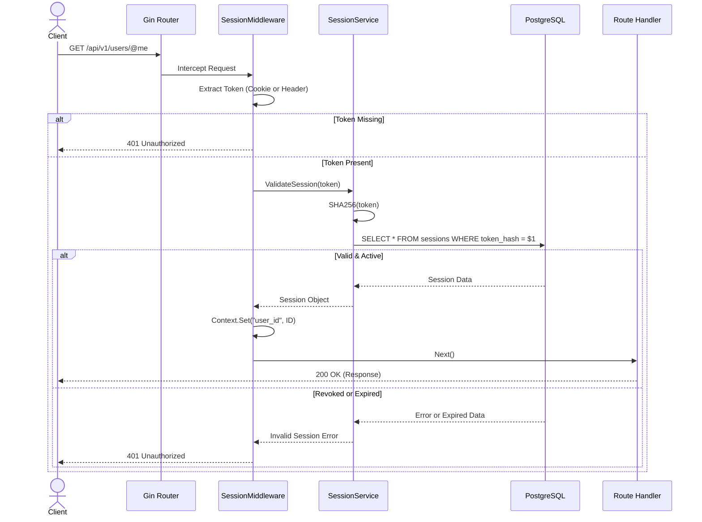

# Auth & Middleware

The API intercepts incoming requests using standard Gin middleware to handle security, logging, and session validation.

## Middleware Stack

The global middleware stack is applied to the Gin router in `cmd/server/main.go` before any routes are registered:

1. **Recovery Middleware (`middleware.RecoveryMiddleware`)**: Catches any panics that occur during request handling, preventing the server from crashing and returning a safe `500 Internal Server Error`.
2. **Logging Middleware (`middleware.LoggingMiddleware`)**: Logs the HTTP method, path, status code, and latency of every request.
3. **CORS Middleware (`middleware.CORSMiddleware`)**: Validates the `Origin` header against the allowed origins specified in the configuration, handling pre-flight `OPTIONS` requests and attaching necessary access-control headers.

## Authentication & Session Validation

Unlike the public endpoints (like `/auth/login`), most API routes require a valid user session. This is enforced by applying the `middleware.SessionMiddleware` to protected route groups.


### Token Extraction
When a request hits a protected route, the `SessionMiddleware` attempts to extract the authentication token:
1. It first checks for an `HttpOnly` cookie matching the `SESSION_COOKIE_NAME` configuration.
2. If the cookie is not present, it falls back to checking the standard `Authorization: Bearer <token>` header.

### Session Validation (`internal/auth/session_service.go`)
Once the token string is extracted, it is passed to the `auth.SessionService`. Note that Synapse uses **Opaque Tokens**, not JWTs.
1. **Hash Verification**: The API applies a `SHA256` hash to the provided opaque token and queries the `sessions` PostgreSQL table for a match.
2. **Expiration Check**: It checks if the session `expires_at` is in the past or if `revoked_at` is set.
3. **Context Injection**: If valid, the middleware attaches the `userID` and `sessionID` to the `*gin.Context`.
   ```go
   c.Set("user_id", session.UserID)
   c.Set("session_id", session.ID)
   ```

### Downstream Usage
Handlers downstream can safely extract the `user_id` knowing it has been cryptographically validated:
```go
userID := c.GetInt64("user_id")
```
This ID is then passed directly into the Service layer (e.g., `service.SendMessage(ctx, channelID, userID, req)`), preventing users from spoofing actions on behalf of others.

## Session Lifecycle
- **Creation**: The `auth.Handler.Login` method generates a 32-byte cryptographically secure random token (`crypto/rand`), stores its `SHA256` hash in PostgreSQL, and attaches the raw token as an `HttpOnly` cookie.
- **Revocation**: The `/auth/logout` endpoint performs a soft-revoke by executing an `UPDATE sessions SET revoked_at = NOW()`, instantly invalidating the token.
- **Cleanup**: A background goroutine in `main.go` periodically sweeps the `sessions` table, permanently deleting records that have been expired for over 30 days.
