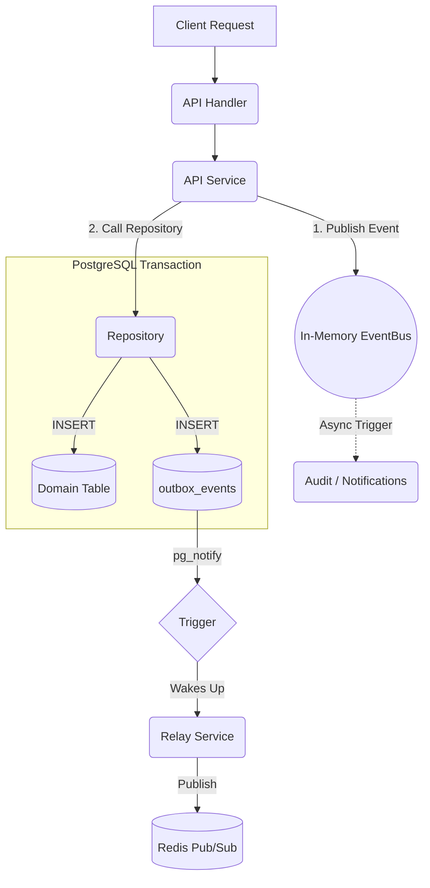

# Events and Transactional Outbox

A fundamental principle of Synapse is the absolute separation of HTTP state mutations (writes) from WebSocket state synchronization (real-time fan-out). The API achieves this reliably using the **Transactional Outbox Pattern** combined with a standard Go Event Bus.

## The Event Bus (`internal/events`)

The `events` package defines an in-memory `EventBus` interface.

```go
type EventBus interface {
    Publish(event interface{})
    Subscribe(eventType interface{}, handler func(event interface{}))
}
```

The `EventBus` acts as a synchronous pub/sub system internal to the API instance. 
1. When a domain service performs a mutation (e.g., `SendMessage`), it creates a domain event (e.g., `MessageCreatedEvent`).
2. It publishes this event to the `EventBus`.
3. Other internal services (like the `AuditService` or `NotificationService`) can subscribe to these events to trigger side-effects (e.g., creating a push notification when a message is sent) without tightly coupling the domains.

## The Transactional Outbox

If the API simply fired a Redis `PUBLISH` command after creating a message in PostgreSQL, a Redis network failure would cause the chat message to save to the database but never reach connected WebSocket clients. This breaks real-time guarantees.

To solve this, the API uses the **Transactional Outbox Pattern**.


### 1. Atomic Database Insertion

Whenever a `Repository` performs a state mutation, it accepts an optional `*OutboxEvent` struct (defined uniquely within each domain to prevent cyclic dependencies):

```go
type OutboxEvent struct {
    ID            int64
    AggregateType string // e.g., "channel"
    AggregateID   int64  // e.g., 100
    EventType     string // e.g., "MESSAGE_CREATE"
    Payload       []byte // The JSON payload for WebSocket clients
    PartitionKey  int    // For Relay sharding
}
```

Inside the repository method, a single SQL `Tx` (Transaction) is used:
1. `INSERT INTO <domain_table> ...` (e.g., `messages`)
2. `INSERT INTO outbox_events ...`
3. `tx.Commit()`

Because they are in the exact same transaction, it is impossible for a message to be created without its corresponding real-time event also being durably saved.

### 2. PostgreSQL Trigger & Relay Handoff

The Go API code *never* explicitly fires the notification. Instead, Synapse relies on a **PostgreSQL Trigger** (defined in `migrations/004_outbox_partitioning.sql`). 

When the transaction commits and the row is successfully written to `outbox_events`, the database trigger automatically fires a `pg_notify('outbox_new', partition_key)` event. This instantly wakes up the background **Relay Service**. 

The Relay service then reads the `outbox_events` table and safely publishes the payload to the Redis Pub/Sub cluster, ensuring guaranteed at-least-once delivery to the Gateway.

This architecture completely decouples the API from Redis. The API handles high-throughput state mutations cleanly and relies on the Relay to guarantee eventual consistency across the WebSocket fleet.
