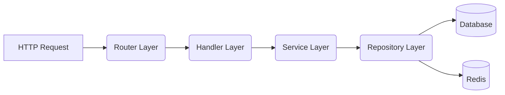

# API Architecture Overview

The `apps/api` service is the primary backend system for Synapse. It provides a RESTful HTTP interface for state mutations (writes) and historical data fetching (reads). It is built using the Gin web framework and follows a strict layered architecture pattern.

## Layered Architecture (Clean Architecture)

To maintain a maintainable codebase, the API strictly isolates responsibilities into horizontal layers. Dependencies only point inwards (Handlers -> Services -> Repositories).

1. **Router Layer (`internal/router`)**: Configures the HTTP endpoints, binds URLs to specific handlers, and attaches middleware.
2. **Handler Layer**: Responsible for HTTP-specific logic. It decodes JSON request bodies, extracts URL parameters, calls the Service layer, and encodes JSON responses. Handlers *never* execute business logic.
3. **Service Layer**: The core business logic. It handles validation, permission checks, orchestrating database transactions via Repositories, and emitting events to the EventBus.
4. **Repository Layer**: The data access layer. It abstracts all PostgreSQL queries (`database/sql`) and Redis interactions, exposing clean interfaces to the Service layer.

## Application Bootstrapping (`main.go`)

The entry point (`cmd/server/main.go`) acts as the dependency injection container. The startup sequence flows as follows:

1. **Configuration**: Environment variables are loaded (`internal/config`).
2. **Snowflake Initialization**: The node ID is registered for generating globally unique IDs.
3. **Database Connections**: PostgreSQL and Redis connection pools are established (`internal/database`).
4. **Dependency Injection**: 
   - All `Repository` structs are instantiated.
   - All `Service` structs are instantiated (injecting the Repositories).
   - All `Handler` structs are instantiated (injecting the Services).
5. **Session Cleanup**: A background goroutine is started to periodically purge expired session tokens from PostgreSQL.
6. **HTTP Server**: The Gin router is initialized, middlewares are applied, and the server begins listening.

## State Mutations vs Real-time

A fundamental design principle of Synapse is **Separation of State**. The API handles all state *mutations* (e.g., saving a message to the database). However, it does **not** directly push that message to active WebSocket users. 

Instead, it relies on two distinct mechanisms:
1. **Transactional Outbox**: The Repository layer writes an `outbox_events` record in the exact same SQL transaction as the state mutation. This outbox record is picked up by the background Relay service for real-time fan-out to the Gateway.
2. **EventBus**: The Service layer publishes an in-memory event to the `EventBus`. Other domains (like Notifications or Audit) listen to this bus to perform internal side-effects without tight coupling.

## Related Documentation
- [Domain Modules](domain-modules.md)
- [Auth & Middleware](auth-and-middleware.md)
- [Database & Repositories](database-and-repositories.md)
- [Events & Outbox](events-and-outbox.md)
