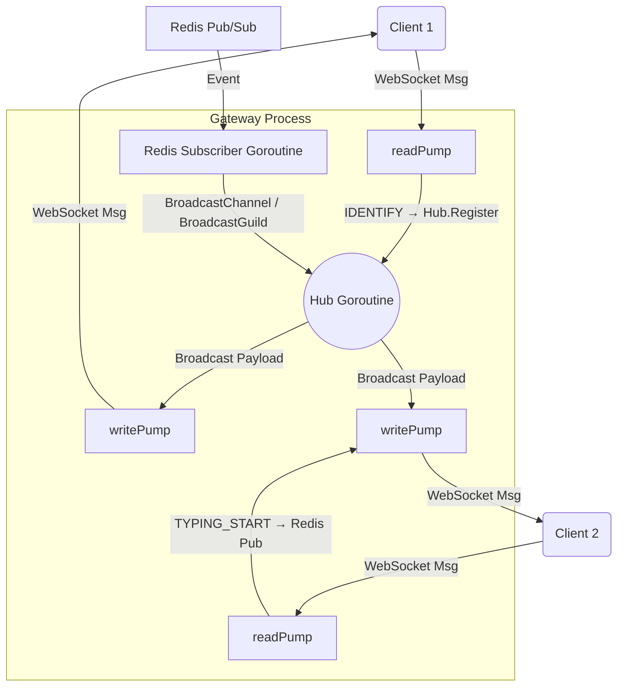

# Hub In-Memory Routing

The `Hub` (`internal/websocket/hub.go`) is the central routing engine of the Gateway. It is responsible for tracking all connected clients and efficiently fanning out incoming messages to the correct sockets.

## The State Maps

The Gateway is stateless with regards to persistence, but highly stateful regarding network connections. It uses three primary `map` structures to track connections:

1. **`clients map[*Client]bool`**
   - **Purpose**: A master registry of every active WebSocket connection on this specific Gateway node.
   - **Usage**: Used for tracking total load, broadcasting system-wide alerts, and targeting specific users (`BroadcastToUser`).

2. **`channelClients map[int64]map[*Client]bool`**
   - **Purpose**: Maps a specific `channel_id` to a set of `Client` pointers.
   - **Usage**: Used to instantly fan-out chat messages (`MESSAGE_CREATE`) to all users currently subscribed to and authorized to view that channel.

3. **`guildClients map[int64]map[*Client]bool`**
   - **Purpose**: Maps a specific `guild_id` (server ID) to a set of `Client` pointers.
   - **Usage**: Used to fan-out server-wide events (e.g., `GUILD_MEMBER_ADD`, `PRESENCE_UPDATE`) to all users connected to that server.

*Note: In Go, a `map[*Client]bool` is the idiomatic way to implement a unique "Set", providing O(1) additions, removals, and lookups without expensive array shifting.*

## The Event Loop (`Run`)

The `Hub` runs a single, continuous `select` loop inside a dedicated goroutine. This loop synchronizes access to the shared maps via an `RWMutex`, preventing race conditions during concurrent modifications.

### 1. `Register` Channel
When a client successfully authenticates, it is pushed to the `Register` channel. The Hub:
- Adds the client to the master `clients` map.
- Iterates over the client's `guildIDs` and adds them to `guildClients`.
- Iterates over the client's `channelIDs` and adds them to `channelClients`.

### 2. `Unregister` Channel
When a connection is lost, it is pushed to the `Unregister` channel. The Hub:
- Removes the client from all three maps.
- Closes the client's `send` channel to prevent goroutine leaks.
- Checks if the nested maps (e.g., `channelClients[channelID]`) are now empty. If so, it deletes the key entirely to prevent memory bloating over time.

### 3. `BroadcastChannel` & `BroadcastGuild`
When a message arrives from Redis, it is pushed to these internal Hub channels. The Hub:
- Acquires a read lock (`h.mu.RLock()`).
- Looks up the target ID (Channel or Guild).
- Iterates over the set of subscribed clients and collects them into a temporary slice.
- Releases the lock.
- Pushes the JSON payload byte array into each client's `send` buffer via a non-blocking `select`.
- If a client's `send` buffer is full (meaning the client's network is too slow to keep up), the Hub drops the client by pushing them to the `Unregister` channel, preventing the entire Gateway from stalling.

## Direct User Broadcasts
The `BroadcastToUser(userID int64, message []byte)` method bypasses the specialized maps. Instead, it acquires a read lock on the master `clients` map, iterates through every connected client, and pushes the payload to any `Client` whose `userID` matches the target. This is highly effective because a single user rarely maintains more than 1 or 2 active connections per Gateway instance, making a dedicated user map unnecessary overhead.
