# Presence Tracking Engine

The Gateway tracks user online/offline status across multiple simultaneous devices without relying on persistent storage. The logic resides in `internal/presence/presence.go`.

## Redis Sorted Sets (`ZSET`)

Presence is tracked using Redis Sorted Sets. This is required because a user may be logged into Synapse on their phone, desktop app, and browser simultaneously. We cannot simply store a boolean `is_online = true`; we must track every active connection independently.

- **Redis Key**: `presence:<user_id>`
- **ZSET Member**: The specific `connID` (UUID) generated when the WebSocket connected.
- **ZSET Score**: A Unix timestamp representing the connection's expiration time (current time + 75 seconds TTL).

## Heartbeat Cycle

1. **Client Side**: The connected client sends a `HEARTBEAT` payload. The server sends a `HELLO` payload at connection time specifying `heartbeat_interval: 45000ms`.
2. **Gateway Side**: The Gateway receives the payload and executes an atomic Lua script (`luaUpdate`) against Redis.
3. **Lua Script Execution**: The script purges expired connections, counts current active connections, adds/refreshes the current `connID` member with a score of `redis.call('TIME') + 75`, and sets a key TTL.

*Note: The Gateway explicitly uses `redis.call('TIME')` inside the Lua script instead of Go's `time.Now()` to prevent clock skew across different Gateway servers from prematurely expiring active connections.*

## Going Offline

When a user closes their app (or their network disconnects without sending a heartbeat):

1. **Grace Period**: The `Client.readPump()` defer block triggers `presence.MarkOffline`. This executes a Lua script (`luaRemove`) to instantly delete that `connID` from the ZSET.
2. **Device Count Evaluation**: The script evaluates `ZCOUNT` to count remaining connections whose expiration score is strictly in the future (`now` to `+inf`).
   - If count > 0: The user is still online on another device.
   - If count == 0: The user has zero active devices.
3. **Deferred Broadcast Event**: If count == 0, the Gateway does *not* instantly broadcast an offline event. It starts a 20-second deferred timer. If the user has not reconnected by the end of the 20 seconds, the Gateway confirms they are still offline using `presence.IsUserOnline`, and only then publishes the `PRESENCE_UPDATE {"status": "offline"}` event.

```mermaid
sequenceDiagram
    actor Client
    participant Gateway
    participant Redis as Redis (ZSET)
    participant PubSub as Redis PubSub

    Client->>Gateway: WebSocket Disconnect
    Gateway->>Redis: EVAL luaRemove(connID)
    
    rect rgb(30, 40, 50)
        Note over Redis: Lua execution
        Redis->>Redis: ZREM presence:UID connID
        Redis->>Redis: ZCOUNT presence:UID now +inf
        Redis-->>Gateway: Remaining Device Count (e.g. 0)
    end
    
    alt Count > 0
        Gateway->>Gateway: Do nothing (still online elsewhere)
    else Count == 0
        Gateway->>Gateway: Start 20s Grace Timer
        Note over Gateway: Wait 20 seconds...
        
        Gateway->>Redis: presence.IsUserOnline() [rdb.Time() then rdb.ZCount()]
        Redis-->>Gateway: Still 0?
        
        alt Yes (Still Offline)
            Gateway->>PubSub: PUBLISH PRESENCE_UPDATE (offline)
        else No (Reconnected)
            Gateway->>Gateway: Cancel Offline Broadcast
        end
    end
```

## Bulk Presence Fetch (`REQUEST_GUILD_PRESENCE`)

When a user opens a guild for the first time (or navigates to the member list), the client sends a `REQUEST_GUILD_PRESENCE` event. 

To avoid spamming Redis with individual `ZCOUNT` queries, the Gateway (`internal/websocket/manager.go`):
1. Queries PostgreSQL for all members of the guild.
2. Uses a **Redis Pipeline** to execute `ZCOUNT presence:<uid> now +inf` for every member in a single round trip.
3. Returns a batched `GUILD_PRESENCE_BULK` payload to the client.
