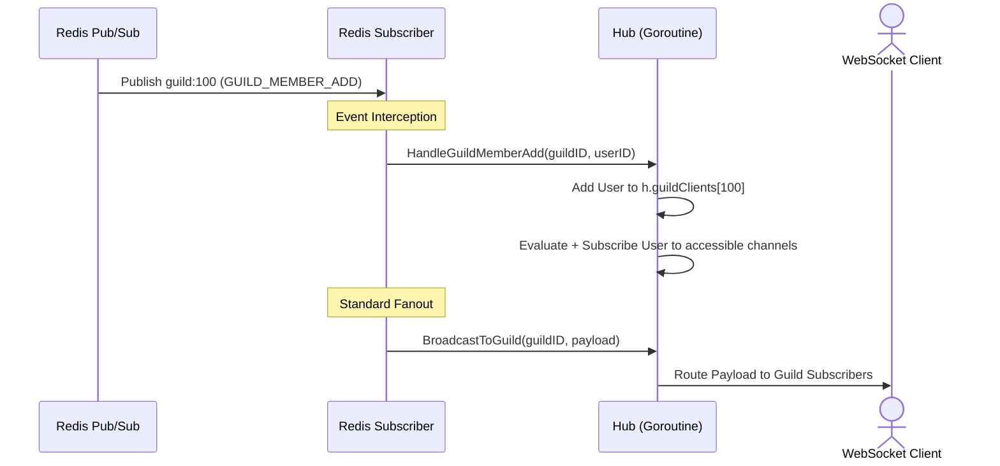

# Pub/Sub Interceptor

The Gateway bridges events from the backend (API/Relay) to connected WebSocket clients using Redis Pub/Sub. The logic for listening and intercepting these events is contained in `internal/pubsub/redis.go`.

## Subscriptions and Patterns

When the Gateway starts, the `Subscriber` creates a single Redis `PSubscribe` connection listening to the following wildcard patterns:

- `channel:*`: Messages, typing indicators, and channel permission updates.
- `guild:*`: Member joins, role updates, and server-wide settings changes.
- `user:*`: Direct message creation, blocks, and personal profile updates.
- `notification:*`: System alerts and push notifications.

When a message is published matching one of these patterns (e.g., `PUBLISH channel:100 {"t":"MESSAGE_CREATE"}`), the `Subscriber` picks it up and routes it to `handleMessage`.

## Interception & State Synchronization

The Gateway does not blindly forward all messages to clients. Some events are "intercepted" to mutate the `Hub`'s internal state *before* broadcasting. This ensures that the Gateway's routing tables (`channelClients`, `guildClients`) stay perfectly in sync with the database without clients having to reconnect.

### Intercepted Events

1. **`GUILD_MEMBER_ADD`**
   - **Action**: Intercepted by `Hub.HandleGuildMemberAdd`. The Hub adds the user's active connections to `h.guildClients`, then iterates every channel in that guild, evaluates permissions via `ResolveChannelAccess`, and subscribes the user to all accessible channels.
   
2. **`GUILD_MEMBER_REMOVE` & `GUILD_BAN_ADD`**
   - **Action**: Intercepted by `Hub.HandleGuildMemberRemove`. Cleanly removes the user from all guild and channel maps. Sends the removed user a `GUILD_DELETE` event so their UI updates immediately.

3. **`GUILD_MEMBER_UPDATE`**
   - **Action**: Intercepted by `Hub.HandleGuildMemberUpdate`. Re-evaluates channel access for the specific user's active connections across all restricted channels in the guild, subscribing or unsubscribing them as required.

4. **`CHANNEL_PERMISSIONS_UPDATE` & `CHANNEL_CREATE`**
   - **Action**: Intercepted by `Hub.HandleChannelPermissionsUpdate`. The Hub re-evaluates access for all connected users. If a user loses access, they are kicked from the `h.channelClients` map and sent a synthetic `CHANNEL_DELETE` payload. If they gain access (or if it's a newly created channel they are allowed to see), they are simply added to the `h.channelClients` map so they can receive future events.

5. **`GUILD_ROLE_UPDATE`**
   - **Action**: Intercepted by `Hub.HandleGuildRoleUpdate`. Similar to channel updates, but evaluates all restricted channels within the guild to see if the role change granted or revoked access for any connected role holders.

6. **`USER_DM_CREATE`**
   - **Action**: Sent via the `user:*` pattern. The Hub intercepts this to instantly add the targeted user's connection to the new DM's `h.channelClients` map, allowing them to receive subsequent `MESSAGE_CREATE` events in that DM seamlessly.

After the Hub processes the interception and updates its maps, the original event payload is safely fanned out to the appropriate clients using the updated routing tables.
