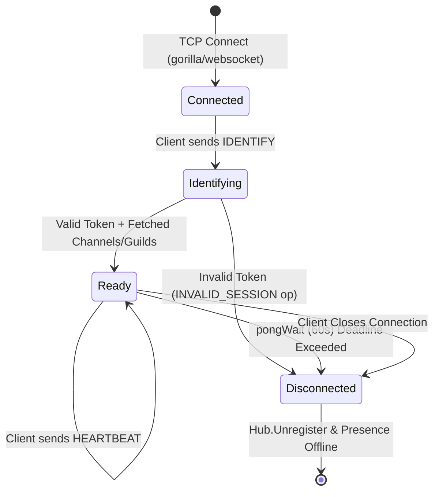

# WebSocket Lifecycle & Connections

The Gateway manages raw TCP/WebSocket connections, handling HTTP upgrades, session verification, heartbeats, and client state tracking. The implementation is primarily located in `internal/websocket/manager.go`.

## Connection Upgrade (`ServeWS`)
When a client hits the `/ws` endpoint, the HTTP request is upgraded to a WebSocket connection using the `gorilla/websocket` library.

1. **Token Extraction**: The server checks for a session token in the HTTP cookie defined by `SESSION_COOKIE_NAME`. If absent, it falls back to the `?token=` query parameter.
2. **Initial Handshake (`HELLO`)**: A `HELLO` frame is immediately sent down the wire informing the client of the expected `heartbeat_interval` (45000ms).
3. **Pumps Setup**: Two goroutines are spawned for each client: `writePump()` and `readPump()`.

## Authentication (`IDENTIFY`)
Clients authenticate by sending an `IDENTIFY` payload. 

1. **Validation**: The payload token (or cached cookie token) is validated against the PostgreSQL `sessions` table via `auth.ValidateSession`. This checks for token validity, expiration, and revoked devices.
2. **Initial State Fetch**: Once authenticated, the Gateway queries PostgreSQL to discover which channels and guilds the user is a member of.
3. **Hub Registration**: The client's connection UUID (`connID`), User ID, `channelIDs`, and `guildIDs` are attached to a `Client` struct, which is then sent to the `Hub` via the `Register` channel.
4. **Ready Frame**: The client receives a `READY` dispatch containing their `user_id` and authorized channel/guild arrays.
5. **Presence Trigger**: The user's online status is registered in Redis (`presence.MarkOnline`), and a `PRESENCE_UPDATE` is fanned out to all their guilds and channels.

## Heartbeats & Timers
To ensure connections are alive and prevent stale file descriptors, the Gateway enforces strict timeouts:
- **`writeWait` (10s)**: Maximum time allowed to write a message to the client.
- **`pongWait` (60s)**: Maximum time allowed to read the next pong message from the client.
- **`pingPeriod` (50s)**: The frequency at which the Gateway sends `PingMessage` frames to the client.

Clients must also send application-level `HEARTBEAT` payloads. The Gateway responds with `HEARTBEAT_ACK` and refreshes the user's presence TTL in Redis.

## Inbound Client Events
The `readPump` parses incoming payloads and routes them via `handleMessage(raw []byte)`:
- `HEARTBEAT`: Responds with `HEARTBEAT_ACK` immediately and resets the `pongWait` read deadline. If the user is authenticated, calls `presence.MarkOnline()`, which purges expired connections in their ZSET, refreshes the TTL, and broadcasts `PRESENCE_UPDATE (online)` if they transitioned from zero connections.
- `IDENTIFY`: Authenticates and initializes session state.
- `TYPING_START`: Rate-limited (3s per channel). Publishes typing events directly to the Redis `channel:<channel_id>` pub/sub stream.
- `REQUEST_GUILD_PRESENCE`: Rate-limited (5s per guild). Queries PostgreSQL for all members of a guild, performs a pipelined Redis `ZCOUNT` across all members to check online status, and returns a `GUILD_PRESENCE_BULK` payload.

## Disconnection Flow
When a connection is lost (or closed unexpectedly), the `defer` block in `readPump()` cleans up the state:
1. **Unregister**: The client is sent to the `Hub.Unregister` channel, removing it from all in-memory routing maps.
2. **Socket Close**: The underlying TCP socket is closed.
3. **Presence Cleanup**: `presence.MarkOffline` is called. If this was the user's last active device, a 20-second grace timer is started. If the user does not reconnect within 20 seconds, a `PRESENCE_UPDATE` ("offline") event is fanned out.
