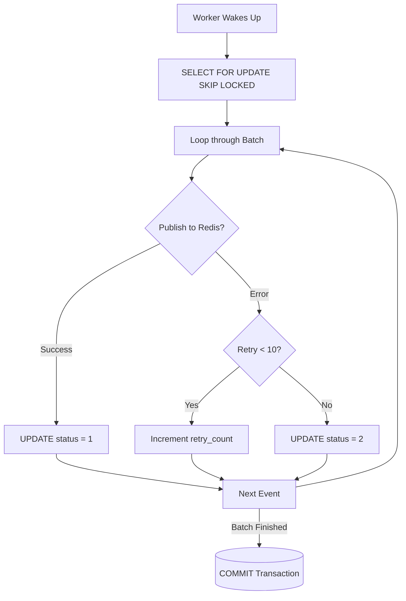

# Batch Processing & Error Handling

The Relay processes outbox events in chunks to minimize database round-trips while maximizing throughput. This logic is implemented in the `processBatch` method (`internal/worker/worker.go`).

## Concurrent Querying (`SKIP LOCKED`)

To fetch pending events, the worker executes the following SQL query:

```sql
SELECT id, aggregate_type, aggregate_id, event_type, payload, retry_count
FROM outbox_events
WHERE status = 0 AND partition_key = $1
ORDER BY id ASC
LIMIT 100
FOR UPDATE SKIP LOCKED
```

- **`status = 0`**: Only selects unprocessed (or retry-able) events.
- **`partition_key = $1`**: Restricts the query to the worker's assigned partition.
- **`LIMIT 100`**: Processes up to 100 events per batch to bound memory usage and transaction lock times.
- **`FOR UPDATE SKIP LOCKED`**: This is the most critical part of the concurrency design. It locks the fetched rows for the duration of the transaction. If another worker (or another instance running the same partition) attempts to fetch rows, PostgreSQL will instantly skip the locked rows and return the next available 100 rows, completely eliminating lock contention.

## Publishing to Redis

For each event fetched in the batch, the worker attempts to publish it to Redis:

1. **Stream Routing**: It constructs the Redis Pub/Sub stream name using the pattern `<aggregate_type>:<aggregate_id>` (e.g., `channel:100` or `guild:50`).
2. **Envelope Construction**: It wraps the raw payload inside a standardized `pubsubEnvelope`:
   ```json
   {
       "op": "DISPATCH",
       "t": "<event_type>",
       "d": <raw_payload>
   }
   ```
3. **Execution**: It executes the Redis `PUBLISH` command.

## State Transitions & Retry Logic

Depending on the outcome of the Redis `PUBLISH` command, the worker mutates the `status` of the outbox record before committing the SQL transaction:



### Success Flow
If the publish succeeds, the worker executes:
```sql
UPDATE outbox_events SET status = 1, processed_at = NOW() WHERE id = $1
```
The event is marked as complete (`status = 1`) and will no longer be selected by future queries.

### Failure Flow
If Redis is down or unreachable, the publish fails. The worker executes a retry increment:
1. `newRetry = e.RetryCount + 1`
2. **Dead-Lettering**: If `newRetry >= 10`, the event is permanently marked as failed (`status = 2`). It will not be retried again, requiring manual intervention or a separate dead-letter cron job to recover.
3. **Retry**: If under the limit, the status remains `0` (pending) so the next batch will pick it up again.
