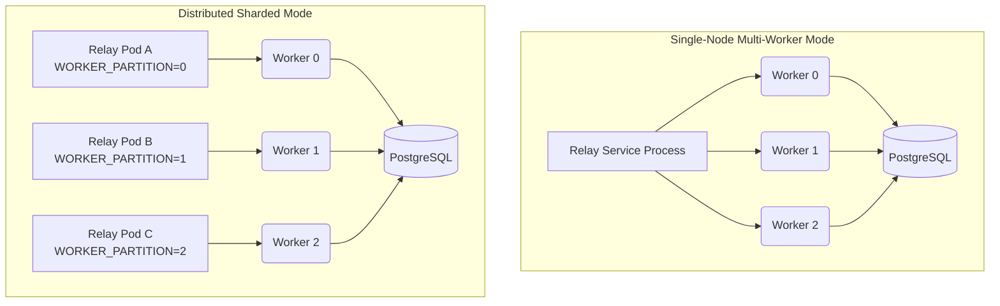

# Partitioning and Scaling

The Relay service is designed to scale horizontally to handle high event throughput from the database without bottlenecking on a single worker process. This is achieved through partition keys on the `outbox_events` table.

## The Partition Key

When the API service inserts a record into `outbox_events`, it assigns a `partition_key` (an integer). The strategy for assigning this key is up to the API (e.g., `guild_id % WORKER_COUNT`), but the Relay's job is simply to process events matching the partition(s) it is assigned.

## Deployment Modes

The Relay service can run in two distinct modes depending on how it is configured via environment variables (see `cmd/server/main.go`).

### 1. Single-Node Multi-Worker Mode (Default)
If `WORKER_PARTITION` is not set, the Relay service will automatically spawn `WORKER_COUNT` (default configured in config) concurrent goroutines.
- Each goroutine is initialized as a separate `worker.Worker`.
- Each worker is assigned a specific `partition` index (from `0` to `WORKER_COUNT - 1`).
- All workers share the same PostgreSQL connection pool and Redis client, polling their respective partitions in parallel.

This is ideal for small to medium deployments where a single Relay pod can handle the entire event load.

### 2. Distributed Sharded Mode
If `WORKER_PARTITION` is explicitly set in the environment (e.g., `WORKER_PARTITION=0`), the Relay service will operate as a dedicated shard.
- It will only spawn a **single** `worker.Worker` for that specific partition.
- It will completely ignore all other partitions.

This allows operations teams to deploy multiple instances of the Relay service (e.g., Relay Pod A handles Partition 0, Relay Pod B handles Partition 1), distributing CPU and network load across the cluster.

## PostgreSQL Notify Filtering

When the PostgreSQL trigger fires a `pg_notify('outbox_new', partition_key::text)` event upon insertion, all `pq.Listener` connections across all Relay workers receive the notification. 

The worker instantly checks if the notification payload (`n.Extra`) matches its assigned `w.partition` (e.g., `n.Extra == "0"`). If it matches, the worker wakes up and executes `processBatch`. If it does not match, the worker ignores it, ensuring that workers do not needlessly wake up to query the database when their specific partition is empty.
