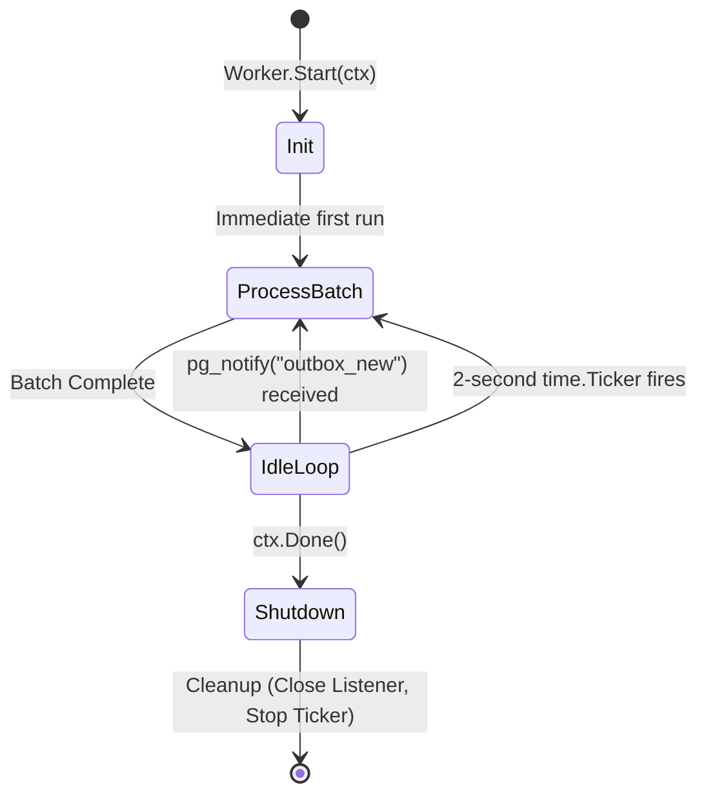

# Worker Lifecycle

The core loop of the Relay service runs in `internal/worker/worker.go`. Its responsibility is to efficiently wake up when new events are available without consuming unnecessary CPU or database connections.

## Dual-Trigger Execution

The `Worker.Start(ctx)` method implements a `for { select }` event loop that triggers the `processBatch` method under two different conditions:

### 1. Push-Based Notifications (`pq.Listener`)
The worker uses PostgreSQL's native `LISTEN/NOTIFY` system to achieve near-instantaneous latency.
- When it starts, it registers a `pq.Listener` on the `outbox_new` channel.
- When a new event is inserted into the database, a PostgreSQL trigger automatically executes a `pg_notify('outbox_new', partition_key::text)` command.
- The PostgreSQL driver wakes up the worker. 
- The worker checks if the `partition_key` payload matches its own assigned partition (`w.partition`). If it matches, it immediately runs `processBatch`.

### 2. Fallback Ticker (Polling)
To ensure no events are ever missed in the event of a dropped notification or network hiccup, a background Go `time.Ticker` fires every **2 seconds**. When this ticker fires, the worker unconditionally attempts to run `processBatch`.

## Start and Shutdown

1. **Immediate Execution**: When the goroutine starts, it runs `processBatch(ctx)` once unconditionally before entering the `select` loop, picking up any backlog that accumulated while the service was offline.
2. **Context Cancellation**: The `select` loop listens on `ctx.Done()`. When `main.go` captures a termination signal (`SIGINT/SIGTERM`), the context is canceled. The worker cleanly finishes its current batch and exits the loop without leaving incomplete transactions.
3. **Resource Cleanup**: The `defer` blocks ensure that the `pq.Listener` is closed and the `time.Ticker` is stopped upon exit to prevent resource leaks.
