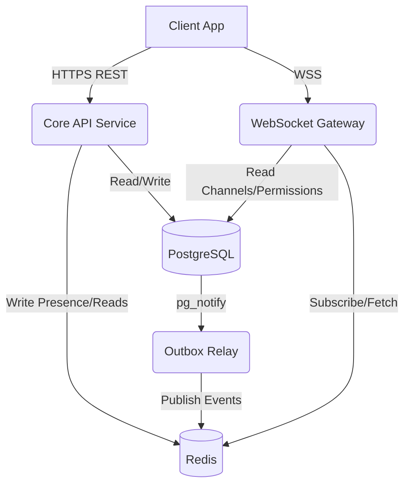

# Backend Architecture & API Specification

## 1. Architectural Philosophy

To handle real-time synchronization at scale, the backend strictly adheres to these principles:

1. **Separation of State:** HTTP APIs are strictly for **State Mutation** (Writes) and **Historical Fetching** (Reads). WebSockets are strictly for **State Synchronization** (Real-time Fan-out).
2. **Immediate Acknowledgment:** The hottest paths (e.g., sending messages) do the absolute minimum work required to achieve ACID compliance (insert to DB + Outbox) and return `201 Created`. All secondary side-effects are asynchronous.
3. **Cursor Only:** `OFFSET` pagination is forbidden for large collections. Snowflake IDs are used for cursor pagination.
4. **Lazy Loading:** The initial WebSocket connection (`READY`) is lightweight. Clients lazy-load heavy relational data (guild members, channel histories) via REST APIs.
5. **Eventual Ordering & Truth:** The REST API and Database remain the absolute source of truth. Clients independently sort incoming events (like messages) using chronological Snowflake IDs to guarantee order.

---

## 2. Backend Modules & Responsibilities

The system is split into distinct services to allow independent scaling.

### A. Core API Service (`apps/api`)
* **Tech:** Go, Gin framework.
* **Role:** The workhorse for all HTTP CRUD operations and authentication.
* **Responsibilities:**
  * Enforcing database invariants (e.g., atomic transactions).
  * Validating Opaque Session Tokens against PostgreSQL.
  * Writing state mutations and `outbox_events` within the exact same transaction boundary.

### B. Realtime State & Caching (`Redis`)
* **Role:** The centralized, highly available brain for volatile user state.
* **Responsibilities:**
  * **Presence Directory:** Tracks active connections (using ZSETs mapped to connection IDs) to infer online/offline status.
  * **Read States:** Stores `channel_reads` in Redis HashMaps as the immediate source of truth for unread badges.

### C. The Outbox Relay (`apps/relay`)
* **Tech:** Go daemon.
* **Role:** Bridges the synchronous DB commits to the asynchronous event-driven world.
* **Responsibilities:**
  * Wakes up via PostgreSQL `pg_notify` triggers when an `outbox_events` record is inserted.
  * Safely publishes the JSON payload to the Redis Pub/Sub cluster.
  * Supports partition-based sharding to horizontally scale event throughput.

### D. WebSocket Gateway (`apps/gateway`)
* **Tech:** Go, Gorilla WebSocket.
* **Role:** Holds idle TCP connections open and routes real-time events.
* **Responsibilities:**
  * Accepts the `IDENTIFY` payload on connection and registers the socket in the internal `Hub`.
  * Listens to Redis Pub/Sub pattern subscriptions globally.
  * **Presence Inference:** Automatically determines status via TCP/WebSocket keep-alive heartbeats, updating Redis presence.
  * Handles local permission state for connected clients, dynamically subscribing/unsubscribing users to channel streams based on real-time role updates.

---

## 3. REST API Contract (State Mutation)

*Note: All IDs passed in URLs or payloads are Snowflake BIGINTs represented as Strings in JSON to prevent precision loss.*

### User & Authentication
| Method | Route | Description |
| :--- | :--- | :--- |
| `POST` | `/api/v1/auth/login` | Returns an opaque session token. |
| `GET` | `/api/v1/users/@me` | Returns current user profile. |
| `GET` | `/api/v1/users/@me/guilds` | Returns user's guild list. |
| `POST` | `/api/v1/dms` | Creates or returns existing DM. Body: `{ "recipient_id": "456" }`. |

### Guilds & Members
| Method | Route | Description |
| :--- | :--- | :--- |
| `POST` | `/api/v1/guilds` | Creates guild. |
| `GET` | `/api/v1/guilds/:guildID` | Fetches guild metadata. |
| `GET` | `/api/v1/guilds/:guildID/members` | **Must use Cursor:** `?after=:userID&limit=50`. |
| `PATCH` | `/api/v1/guilds/:guildID/members/:userID` | Modifies member (nickname, mute status). |

### Roles & Permissions
| Method | Route | Description |
| :--- | :--- | :--- |
| `GET` | `/api/v1/guilds/:guildID/roles` | Lists roles. |
| `POST` | `/api/v1/guilds/:guildID/roles` | Creates a new role with bitmask. |
| `PATCH` | `/api/v1/guilds/:guildID/roles/:roleID` | Updates a role (name, color, bitmask). |
| `DELETE`| `/api/v1/guilds/:guildID/roles/:roleID` | Deletes a role. |
| `PUT` | `/api/v1/guilds/:guildID/members/:userID/roles/:roleID` | Assigns a role to a member. |

### Channels
| Method | Route | Description |
| :--- | :--- | :--- |
| `GET` | `/api/v1/guilds/:guildID/channels` | Fetches all channels for a guild. |
| `POST` | `/api/v1/guilds/:guildID/channels` | Creates a new channel/category. |
| `PATCH` | `/api/v1/channels/:channelID` | Edits channel details. |
| `DELETE`| `/api/v1/channels/:channelID` | Soft-deletes channel. |

### Messages & Interactions
| Method | Route | Description |
| :--- | :--- | :--- |
| `GET` | `/api/v1/channels/:channelID/messages` | **Must use Snowflake cursor:** `?before=:messageID&limit=50`. |
| `POST` | `/api/v1/channels/:channelID/messages` | Inserts DB + Outbox. Returns `201` immediately. |
| `PATCH` | `/api/v1/channels/:channelID/messages/:messageID` | Updates message content. |
| `DELETE`| `/api/v1/channels/:channelID/messages/:messageID` | Soft-deletes message. |
| `POST` | `/api/v1/channels/:channelID/read` | Updates Redis Hash read state. |
| `PUT` | `/api/v1/channels/:channelID/messages/:messageID/reactions/:emoji` | Idempotent reaction add. |
| `DELETE`| `/api/v1/channels/:channelID/messages/:messageID/reactions/:emoji` | Idempotent reaction remove. |

### Invites
| Method | Route | Description |
| :--- | :--- | :--- |
| `POST` | `/api/v1/guilds/:guildID/invites` | Generates a new invite code. |
| `GET` | `/api/v1/invites/:code` | Previews invite metadata. |
| `POST` | `/api/v1/invites/:code/join` | Consumes invite and adds user to guild. |

---

## 4. WebSocket Contract (Real-Time Synchronization)

WebSockets are strictly for propagating state changes downstream.

### A. Client -> Gateway (Inbound)
* `IDENTIFY`: Initial handshake containing the opaque session token. Registers socket in the Hub.
* `HEARTBEAT`: Sent periodically to keep the TCP connection alive. Gateway uses this to infer presence.
* `TYPING_START`: Sent while actively typing. Server-side rate-limited to once per 3 seconds per channel.
* `REQUEST_GUILD_PRESENCE`: Fetches bulk online status for members of a guild.

### B. Gateway -> Client (Outbound / Fan-Out)

#### Connection & Identity
* `READY`: Minimal payload containing user ID and authorized channels/guilds.
* `HELLO`: Contains `heartbeat_interval: 45000` (ms). Sent by the Gateway immediately upon connection.

#### Messaging
* `MESSAGE_CREATE`: A new message in a subscribed channel. *(Clients must sort incoming messages by Snowflake ID)*.
* `MESSAGE_UPDATE`: A message was edited.
* `MESSAGE_DELETE`: A message was deleted.
* `MESSAGE_REACTION_ADD`: Someone added an emoji.
* `MESSAGE_REACTION_REMOVE`: Someone removed an emoji.
* `TYPING_START`: Another user started typing in a viewed channel.

#### Structure & Moderation
* `CHANNEL_CREATE` / `CHANNEL_UPDATE` / `CHANNEL_DELETE`: Triggers UI hierarchy re-renders.
* `ROLE_CREATE` / `ROLE_UPDATE` / `ROLE_DELETE`: Propagates role changes.
* `GUILD_DELETE`: Sent to a user when they are removed from a guild (ban or kick).
* `GUILD_MEMBER_UPDATE`: Someone's role or nickname changed.
* `GUILD_MEMBER_ADD`: A new user joined a guild.
* `PRESENCE_UPDATE`: A user's online status changed.

#### Direct Messages & Presence
* `USER_DM_CREATE`: A new DM conversation was created. Sent directly to both participants.
* `GUILD_PRESENCE_BULK`: Response to a `REQUEST_GUILD_PRESENCE` request. Returns online status for all guild members.