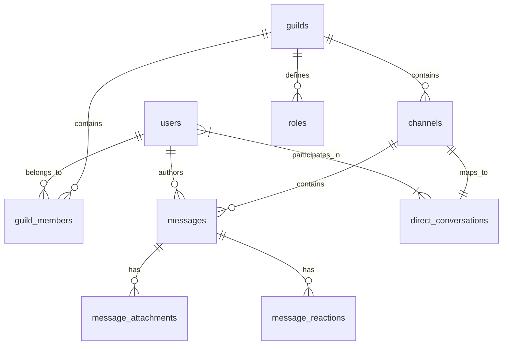

# Database Schema
Refer to `apps/api/migrations/001_initial_schema.sql` for the full primary schema.
Contains `users`, `guilds`, `guild_members`, `channels`, `direct_conversations`, `messages`, `roles`, and `outbox_events`.

