# Message Flow
1. Client posts a message to REST API `POST /api/v1/channels/:id/messages`.
2. Core API stores the message in PostgreSQL (`messages` table).
3. In the exact same SQL transaction, Core API inserts an event into `outbox_events`.
4. PostgreSQL trigger fires a `pg_notify` to awaken the Relay service.
5. Relay service fetches the outbox event and publishes it to Redis Pub/Sub (`channel:ID`).
6. Gateway, subscribed to Redis, receives the event.
7. Gateway pushes the message payload over WebSocket to all clients with access to that channel.

```mermaid
sequenceDiagram
    actor Client
    participant API as Core API
    participant PG as PostgreSQL
    participant Relay as Outbox Relay
    participant Redis as Redis Pub/Sub
    participant Gateway as WebSocket Gateway
    actor Receiver as Subscribed Client

    Client->>API: POST /api/v1/channels/:id/messages
    
    rect rgb(30, 40, 50)
        Note over API,PG: Atomic Transaction
        API->>PG: INSERT INTO messages
        API->>PG: INSERT INTO outbox_events
        PG-->>API: COMMIT Success
    end
    
    API-->>Client: 201 Created
    
    PG-xRelay: pg_notify('outbox_new')
    
    Relay->>PG: SELECT FOR UPDATE SKIP LOCKED
    PG-->>Relay: Return pending outbox_events
    
    Relay->>Redis: PUBLISH channel:ID payload
    Relay->>PG: UPDATE status = 1 (Processed)
    
    Redis-->>Gateway: Broadcast payload
    Gateway->>Receiver: WebSocket Event (MESSAGE_CREATE)
```

