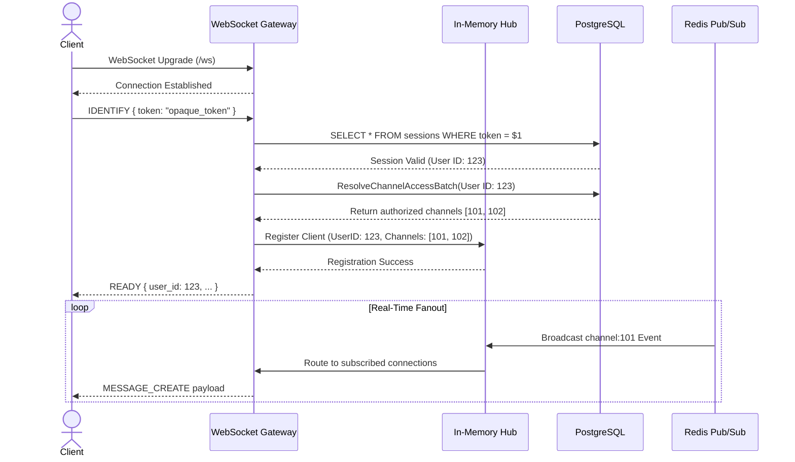

# WebSocket Flow
1. Client establishes a standard WebSocket connection to `/ws`.
2. Client sends an `IDENTIFY` JSON payload containing their Opaque session token.
3. Gateway validates the token against the PostgreSQL `sessions` table.
4. Gateway queries PostgreSQL for all channels and guilds the user has access to.
5. Gateway registers the connection in the in-memory `Hub` and dynamically subscribes the client to internal pub/sub topics for those authorized channels.
6. Gateway sends a `READY` payload back to the client.
7. Real-time events received by the Gateway from the Relay via Redis are fanned out directly to authorized clients.

